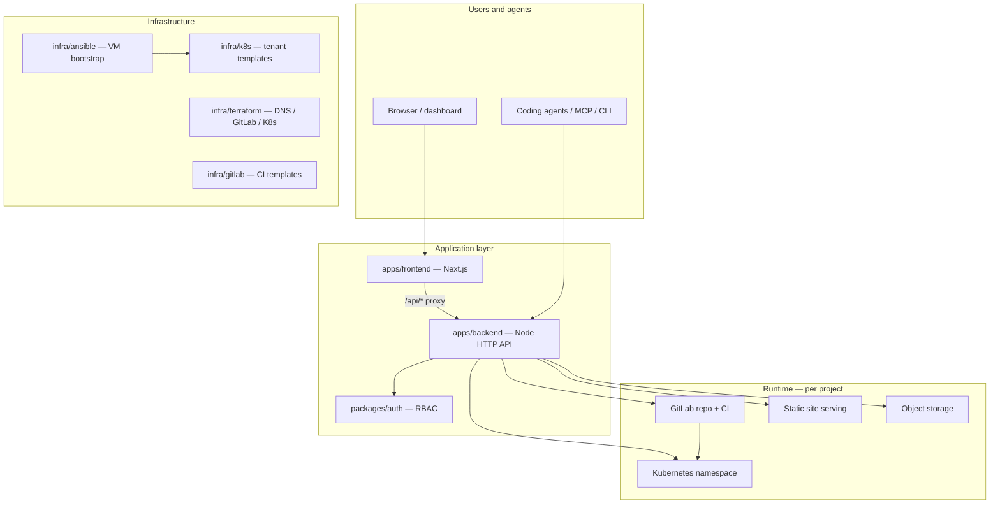

# divband architecture

This document describes how the divband monorepo is organized, how the control plane orchestrates tenant projects, and how traffic reaches hosted workloads. For product scope and release readiness, see `docs/product.md`. For the prioritized minimal MVP cut, see `docs/mvp-scope.md`. For running the stack locally, see `docs/local-mvp.md`. For how local development differs from production deployment entrypoints, see `docs/development-vs-production.md`.

## Platform purpose

`divband` is a multi-tenant website hosting platform for isolated customer projects. Each project can be published on a managed platform subdomain such as `project1.divband.ir` and can also attach a verified custom domain such as `project2.com`.

The platform owns the control plane for users, projects, GitLab repositories, CI/CD, Kubernetes namespaces, routing, DNS verification, certificates, audit events, and billing-facing lifecycle state. Customer code runs in project-scoped runtime boundaries rather than directly in the shared control plane.

Two hosting paths coexist:

1. **Full project deploy** — GitLab CI builds and deploys into an isolated Kubernetes namespace; ingress routes by HTTP `Host` header.
2. **Instant static publish** — Agents upload files via `/api/v1/publish`, finalize a version, and the backend serves them from object storage without a Kubernetes workload.

## System overview



## Monorepo layout

```text
divband/
├── apps/
│   ├── backend/         # Platform API and orchestration service
│   └── frontend/        # Next.js dashboard and embedded API proxy
├── packages/
│   ├── auth/            # Shared authentication and authorization logic
│   ├── mcp-server/      # MCP tools for agent instant publish
│   └── agent-skill/     # CLI helpers (e.g. publish-static-site.mjs)
├── infra/
│   ├── ansible/         # VM bootstrap: k3s, ingress, GitLab, runners, control plane
│   ├── k8s/             # Per-tenant Kubernetes manifests
│   ├── terraform/       # GitLab projects, DNS, Kubernetes tenant modules
│   └── gitlab/          # GitLab CI templates and runner notes
├── docs/                # Architecture, product, security, operations, and runbooks
├── demo/                # Walkthroughs and safe examples (not auto-deployed)
├── sandbox/             # Draft experiments (not auto-deployed)
├── tests/e2e/           # End-to-end flow tests
└── public/              # Agent discovery (/.well-known/agent.json, llms.txt, openapi.json)
```

| Path | Role |
| --- | --- |
| `apps/backend` | Platform API: auth, projects, provisioning, deployments, domains, publishing |
| `apps/frontend` | Next.js app: dashboard UI and in-process API proxy to the backend |
| `packages/auth` | Shared RBAC (`owner` / `admin` / `developer` / `viewer` permissions) |
| `packages/mcp-server` | MCP server exposing publish tools against the divband API |
| `packages/agent-skill` | Agent-facing CLI scripts for static publish and skill install |
| `infra/ansible` | VM-centric bootstrap for k3s, ingress, cert-manager, GitLab, runners |
| `infra/k8s` | Tenant templates: namespace, quota, RBAC, ingress, certificates |
| `infra/terraform` | Modules for GitLab projects, DNS records, and Kubernetes tenants |
| `infra/gitlab` | CI templates for static sites and full-stack container deploys |

Root `package.json` defines npm workspaces and dev scripts (`dev:backend`, `dev:frontend`, `dev:mvp`).

## Core services

1. **Frontend dashboard (`apps/frontend`)** — lets users create projects, connect domains, inspect deployments, manage secrets, invite members, and use a preview AI assistant to draft reviewed changes.
2. **Backend platform API (`apps/backend`)** — orchestrates users, projects, GitLab/GitHub repositories, GitLab runners, Kubernetes namespaces, routes, DNS verification, deployments, certificates, audit logs, and agent instant publish.
3. **Auth package (`packages/auth`)** — centralizes project roles, permissions, and project-scoped access checks reused by the API and future workers.
4. **GitLab integration (`infra/gitlab`)** — creates one GitLab project per divband project, configures CI/CD variables, and assigns project-specific runner tags.
5. **Kubernetes runtime (`infra/k8s`)** — creates one private namespace per project with resource quotas, network policies, service accounts, workloads, services, and host-based routes.
6. **Terraform stacks (`infra/terraform`)** — provision durable resources such as DNS zones and records, GitLab groups/projects, runners, registries, and Kubernetes clusters. See [`docs/infrastructure-orchestration.md`](infrastructure-orchestration.md) for Ansible vs Terraform ownership and bootstrap automation.

## Backend (`apps/backend`)

The backend is a Node.js HTTP server built around a single orchestrator class. There is no Express layer; routing is handled directly in application code.

### Entry points

| File | Purpose |
| --- | --- |
| `src/server.ts` | Standalone process on port 3000: health checks, static-site serving, object uploads, API routing, persistence after each request |
| `src/backend-service.ts` | Route handlers and business logic; exported for reuse by the Next.js API route |
| `src/index.ts` | Public package exports for embedding in the frontend |

### Data layer

Application state is held in a `BackendStore` — a set of in-memory `Map`s for users, sessions, organizations, projects, domains, deployments, publish metadata, audit events, and related records (`src/store.ts`).

Persistence is pluggable via `RuntimeStore` (`src/runtime-store.ts`):

| Driver | Behavior |
| --- | --- |
| `memory` | Local MVP default; state resets on process restart |
| `postgres` | Durable storage; schema in `apps/backend/migrations/` |

### Service boundaries

Each external system has a dedicated service module. In local MVP mode, most integrations are mocked or disabled; see `docs/local-mvp.md`.

| Service | Module | Local MVP |
| --- | --- | --- |
| Auth / sessions | `services/auth.ts` | Real |
| GitLab / GitHub | `services/gitlab.ts`, `services/github-oauth.ts` | GitHub OAuth can be real; GitLab is service-backed |
| Kubernetes | `services/kubernetes.ts` | `KUBERNETES_CONFIG_MODE=disabled` |
| DNS verification | `services/dns-verification.ts` | Token-based mock |
| Certificates | `services/certificate-status.ts` | Metadata only |
| Deployments | `services/deployment-status.ts` | Real API; CI reporting mocked |
| Static publishing | `services/publishing.ts`, `services/static-serving.ts` | In-memory object storage |
| Object storage | `services/object-storage.ts` | In-memory or S3-compatible |
| Audit / rate limits | `services/audit-log.ts`, `services/rate-limit.ts` | Real |

### API surface

Route handling lives in `BackendService.handle()` (`src/backend-service.ts`). Main groups:

| Group | Examples |
| --- | --- |
| Auth | `/auth/register`, `/auth/login`, OAuth/GitHub identity, sessions, password reset |
| Organizations and projects | CRUD, members, environment variables, secrets |
| Provisioning | GitLab/GitHub repository, Kubernetes namespace, platform subdomain |
| Deployments | Create, status reports, logs, rollback |
| Domains | Add, verify DNS, certificate status |
| Publishing | `/api/v1/publish/*` — create, upload, finalize, claim |
| Admin | Platform operations: audit, abuse, runner health |
| AI change requests | Preview/mock only (post-MVP) |

Authorization uses `@divband/auth`. Project roles map to permissions such as `project:read`, `deployment:trigger`, `domain:manage`, and `secret:manage`. The `can(role, permission)` helper enforces checks before mutating project state.

OpenAPI definitions live in `apps/backend/openapi.yaml` and `public/openapi.json`.

### Project lifecycle

Creating a project generates a lifecycle plan (`src/project-lifecycle.ts`):

```text
slug              → globally unique project identifier
gitlabPath        → {ownerPath}/{slug}
namespace         → project-{slug}
platformHostname → {slug}.divband.ir
runnerTag         → divband-{slug}
```

Status progresses through: `draft` → `repository_provisioned` → `namespace_provisioned` → `building` → `deployed` → domain states (`domain_pending_verification`, `domain_active`) or `failed` / `archived`.

Required provisioning steps when Kubernetes apply is enabled:

1. **Automatic on `POST /projects`:** provision namespace `project-{slug}`, apply the welcome stack (nginx + ingress), record a successful welcome deployment, and attach the platform hostname.
2. **Optional follow-up:** create GitLab/GitHub repository, configure runner tag.
3. **Later:** GitLab CI replaces the welcome page with the customer's application in the same namespace.

Manual retry endpoints remain available: `POST /projects/{id}/kubernetes-namespace` (idempotent welcome reprovision) and `POST /projects/{id}/platform-subdomain` (when a later deployment succeeds outside the automatic path).

## Frontend (`apps/frontend`)

The frontend is a **Next.js** app with three layers:

1. **App Router pages** — `app/page.tsx`, `app/projects/[projectId]/...` for routed views.
2. **API proxy** — `app/api/[[...path]]/route.ts` embeds `BackendService` in-process with the same config defaults as the standalone server.
3. **Dashboard UI** — `src/dashboard.ts` is a vanilla TypeScript controller that renders HTML and calls `/api`. `src/DashboardApp.tsx` is a thin React wrapper that mounts the controller on the client.

Dashboard pages cover sign-up/sign-in, project list and create, repository status (GitHub connect), deployments, domains, environment variables, logs, admin views, and a preview AI assistant.

## Agent and MCP integration

Agents and coding tools can publish static sites without a full project setup:

1. `POST /api/v1/publish` — create a publish session and receive upload URLs.
2. Upload files to presigned URLs.
3. `POST /api/v1/publish/{slug}/finalize` — activate the version.
4. Optionally `POST /api/v1/publish/{slug}/claim` — attach an anonymous publish to a signed-in user.

Supporting packages:

| Asset | Purpose |
| --- | --- |
| `packages/mcp-server` | MCP server with publish tools against the divband API |
| `packages/agent-skill/scripts/publish-static-site.mjs` | CLI to publish a local directory |
| `public/.well-known/agent.json` | Agent discovery metadata |
| `public/llms.txt` | LLM-oriented product and API summary |

See `docs/agent-instant-hosting.md` for the full publish contract.

## Request flow

### GitLab/Kubernetes workload path

1. A browser requests `project1.divband.ir` or `project2.com`.
2. DNS points the hostname to the divband ingress or Gateway API layer.
3. The ingress routes by HTTP `Host` header after TLS termination.
4. The route selects the service in the matching project namespace.
5. The service serves the deployed version for that project.
6. Logs, metrics, and audit events are tagged with the project ID and namespace.

### Instant static serving path

1. A browser requests `{slug}.divband.ir` or an assigned custom domain for an instant static site.
2. DNS points the hostname to the divband static serving edge rather than a project namespace ingress.
3. The serving layer resolves the HTTP `Host` header to a published static site record, not a Kubernetes workload.
4. Routing metadata maps `slug → currentVersionId` so the active version can change atomically without moving files.
5. The request path maps to an object storage key using `sites/{slug}/versions/{versionId}/{path}`.
6. The static serving layer applies file resolution rules before reading object storage:
   - `/` serves `index.html`.
   - Direct file paths serve exact objects.
   - Subdirectories prefer their own `index.html`.
   - Unknown paths optionally fall back to `index.html` when `spaMode` is enabled.
   - Missing paths return a generated directory listing or a `404` response depending on site configuration.
7. Logs, metrics, and audit/abuse events are tagged with the static site ID, slug, host, and version ID.

Locally, static sites are served by `server.ts` via `StaticServingService`; use the `Host` header with `{slug}.localhost.test` when DNS is not configured.

## Provisioning flow

1. User creates a project in the dashboard (`POST /projects`).
2. Backend stores project metadata and validates the globally unique slug.
3. When `KUBERNETES_APPLY=true` and `DIVBAND_AUTO_PROVISION_PROJECTS` is not disabled, the backend automatically:
   - provisions Kubernetes namespace `project-{slug}`;
   - applies quota, RBAC, network policy, a nginx **welcome deployment**, service, and platform ingress from `infra/k8s/base/` (`welcome-deployment.yaml`, `ingress-platform.yaml`);
   - records a successful welcome deployment;
   - attaches the platform hostname `{slug}.{username}.{platformDomain}`.
4. Backend creates a GitLab project or GitHub repository when the user connects source control (`POST /projects/{id}/gitlab-repository` or `…/github-repository`).
5. GitLab CI builds and deploys the customer's application, replacing the welcome page in the same namespace.
6. User can add custom domains after DNS ownership verification succeeds.

Local development (`npm run dev:mvp`) skips step 3 because `KUBERNETES_CONFIG_MODE=disabled` and `KUBERNETES_APPLY` is off.

## Infrastructure

Production deployment is VM-centric by default:

1. **`make deploy-production`** — builds Docker images, pushes to a registry, runs Ansible (`scripts/deploy-production.sh`).
2. **`infra/ansible/playbooks/site.yml`** — installs k3s, ingress, cert-manager, External Secrets, GitLab, runners, observability, and the divband control plane.
3. **`infra/k8s/base/`** — tenant templates: namespace, quota, network policy, RBAC, deployments, ingress/HTTPRoute, certificates.
4. **`infra/terraform/`** — modules for GitLab projects, DNS records, and Kubernetes tenants.
5. **`infra/gitlab/ci-templates/`** — CI for static sites and container deploys.

See `docs/vm-reference-architecture.md` for VM topology and Ansible inventory mapping.

## Isolation boundaries

- One GitLab repository per divband project.
- One Kubernetes namespace per project.
- Namespace-scoped service account and RBAC for deployment.
- Default-deny network policies for ingress and egress.
- Per-project secrets and CI/CD variables.
- Project-specific runner tags for jobs that can deploy.
- Per-project audit events and operational logs.

## Local development

From the repository root:

```sh
npm install
npm run dev:mvp        # Next.js on :3000 with embedded API
# or separately:
npm run dev:backend    # standalone API on :3000
npm run dev:frontend   # Next.js on :3000
```

Local MVP uses in-memory state, mocked Kubernetes/GitLab/DNS/certificates, and seeds demo users when `DIVBAND_SEED_DEMO_DATA=1`. Run `npm test` for typecheck and backend smoke tests.

On k3s/VPS backends with `KUBERNETES_APPLY=true`, project creation auto-provisions the welcome stack — see [`README.md`](../README.md#project-auto-provision-on-k3s).

## Implementation maturity

The repository is a **platform skeleton with working local flows**, not a fully wired production deployment.

| Working locally | Working on k3s/VPS (when bootstrapped) | Still skeleton or TODO |
| --- | --- | --- |
| Auth, projects, deployments (mock CI) | Auto welcome stack on project create | Production DNS/TLS for all tenant hostnames |
| GitHub OAuth and repository provisioning | `kubectl apply` via backend with mounted kubeconfig | CI templates wired into every new repo |
| In-memory static publish loop | Platform ingress + cert-manager add-ons (Ansible) | Billing, abuse controls, production AI assistant |
| Dashboard for core journeys | | Durable Postgres as default everywhere |

Detailed capability status and backlog items are tracked in [`docs/product.md`](product.md).

## Related documentation

| Topic | Document |
| --- | --- |
| Product source of truth | [`product.md`](product.md) |
| MVP scope | [`mvp-scope.md`](mvp-scope.md) |
| Local vs production | [`development-vs-production.md`](development-vs-production.md), [`local-mvp.md`](local-mvp.md) |
| Operator runbook | [`operations.md`](operations.md) |
| Tenancy model | [`tenancy.md`](tenancy.md) |
| Bootstrap ownership | [`infrastructure-orchestration.md`](infrastructure-orchestration.md) |
| K8s templates | [`infra/k8s/README.md`](../infra/k8s/README.md) |
| Ansible bootstrap | [`infra/ansible/README.md`](../infra/ansible/README.md) |
| CI deploy loop | [`deployments.md`](deployments.md), [`gitlab.md`](gitlab.md) |
| Auto-provision entry | [`README.md`](../README.md#project-auto-provision-on-k3s) |
