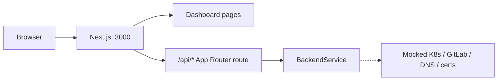
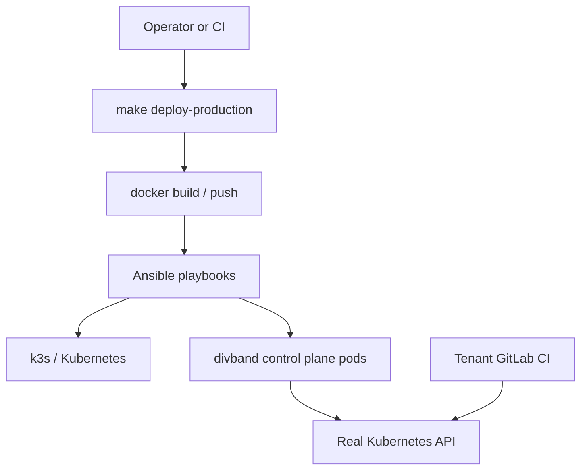

# Development vs production run paths

This document explains the **two distinct ways** to run divband from this repository: a **local development path** for changing application code and using the dashboard in a browser, and an **infrastructure / production path** that builds container images and deploys the control plane on VMs and Kubernetes with real GitLab, DNS, and cluster integrations.

The same application code lives under `apps/backend` and `apps/frontend`. What changes is **how you start it**, **which environment variables apply**, and **which external systems are real vs mocked**.

## Quick comparison

| | Local development | Infrastructure / production |
| --- | --- | --- |
| **Goal** | Edit code and verify behavior in the browser quickly | Bootstrap platform VMs/cluster and run the control plane for operators or customers |
| **Typical command** | `npm run dev:mvp` | `make deploy-production REGISTRY=... TAG=...` |
| **Primary docs** | [`local-mvp.md`](./local-mvp.md) | [`../infra/ansible/README.md`](../infra/ansible/README.md), [`infrastructure-orchestration.md`](./infrastructure-orchestration.md) |
| **Persistence** | In-memory (`PERSISTENCE_DRIVER=memory`) by default | PostgreSQL and durable object storage (see [`../apps/backend/PRODUCTION.md`](../apps/backend/PRODUCTION.md)) |
| **Kubernetes** | `KUBERNETES_CONFIG_MODE=disabled` (mocked in the service layer) | `kubeconfig` or `in_cluster` with real manifests under `infra/k8s/base/` |
| **GitLab / tenant CI** | Mocked or optional real GitHub OAuth locally | Real GitLab projects, runners, and `infra/gitlab/ci-templates/` per tenant project |
| **Infra tooling** | Not required | Ansible, Terraform (optional), k3s/K8s, pipelines, DNS |

## Flow 1: Local development

### Entry scripts

Root [`package.json`](../package.json) defines npm workspace scripts with **local-safe defaults** (memory persistence, Kubernetes disabled, demo seed data):

| Script | What it runs |
| --- | --- |
| `npm run dev:mvp` | **Recommended.** Runs `dev:frontend` only — one Next.js dev server. |
| `npm run dev:frontend` | Next.js on `http://localhost:3000` with the API embedded in-process. |
| `npm run dev:backend` | Standalone Node HTTP API on `http://localhost:3000` (`apps/backend/src/server.ts`). |

Do **not** run `dev:backend` and `dev:frontend` at the same time: both bind port **3000**.

### Runtime shape



1. **`npm run dev:mvp`** starts Next.js (`next dev -H 0.0.0.0 -p 3000` in `apps/frontend`).
2. Dashboard UI calls the API under **`/api/...`** (see `apps/frontend/src/dashboard.ts`).
3. [`apps/frontend/app/api/[[...path]]/route.ts`](../apps/frontend/app/api/[[...path]]/route.ts) loads `BackendService` in the same Node process and applies `applyLocalDefaults()` when env vars are unset (memory store, `KUBERNETES_CONFIG_MODE=disabled`, `DIVBAND_SEED_DEMO_DATA=1`, etc.).
4. External integrations are **mocked or disabled** as described in [`local-mvp.md`](./local-mvp.md). GitHub OAuth can be real if you set `GITHUB_OAUTH_CLIENT_ID` and `GITHUB_OAUTH_CLIENT_SECRET`.

There is **no** `docker-compose.yml` on the default path; Compose is only mentioned as a future option when you need local Postgres, MinIO, or mail sinks.

### Minimal local loop

```sh
npm install
npm run dev:mvp
```

Open **http://localhost:3000**. Demo accounts (password `DemoPass123!`) are listed in [`local-mvp.md`](./local-mvp.md) when `DIVBAND_SEED_DEMO_DATA=1`.

### API URL conventions locally

| Client | Base path | Example |
| --- | --- | --- |
| Dashboard (browser) | `/api` | `POST /api/auth/register` |
| Standalone backend (`dev:backend`) | No `/api` prefix on the server | `POST /auth/register` |
| `curl` against Next (`dev:mvp`) | Use `/api` | `curl http://localhost:3000/api/healthz` |
| `curl` against standalone backend | No `/api` prefix | `curl http://localhost:3000/healthz` |

Smoke examples in [`local-mvp.md`](./local-mvp.md) that omit `/api` apply to **`dev:backend`** only. When using **`dev:mvp`**, prefix API paths with `/api` (except `v1` publish routes, which are already under `/api/v1/...` in the browser).

### Optional: backend-only or tests

- **`npm run dev:backend`** — API and static-site serving without the Next dashboard; useful for `curl`, agent publish scripts, and backend smokes.
- **`npm test`** — root typecheck plus backend smoke scripts (`smoke:controls`, `smoke:restore`, `smoke:publish`).
- **E2E** — [`tests/e2e/README.md`](../tests/e2e/README.md) expects `npm run dev:mvp` and a Chrome CDP instance.

## Flow 2: Infrastructure and production

### Control-plane deployment (platform operators)

This path **does not** replace local `npm run dev:*`. It builds images and installs the divband backend/frontend into a bootstrapped environment.

| Step | Mechanism |
| --- | --- |
| Build and push images | `scripts/deploy-production.sh` (via `make deploy-production`) |
| VM / cluster bootstrap | Ansible [`infra/ansible/playbooks/site.yml`](../infra/ansible/playbooks/site.yml) |
| Bootstrap planning | [`infra/orchestration/`](../infra/orchestration/) and [`infrastructure-orchestration.md`](./infrastructure-orchestration.md) |
| Optional DNS / catalog | Terraform under [`infra/terraform/`](../infra/terraform/) |
| CI deploy to a single VPS | [`.github/workflows/deploy-vps.yml`](../.github/workflows/deploy-vps.yml) → `deploy-divband-from-github.yml` |

Example:

```sh
make deploy-production REGISTRY=registry.example.com/divband/control-plane TAG=v1.0.0
```

The wrapper builds `apps/backend` and `apps/frontend` Docker images, pushes them to `REGISTRY`, then runs Ansible with `divband_backend_image_repository`, `divband_frontend_image_repository`, and `divband_image_tag`. See [`README.md`](../README.md) and [`infra/ansible/README.md`](../infra/ansible/README.md) for inventory and secrets.



Production backend configuration (Postgres, S3, kubeconfig, secrets) is documented in [`apps/backend/PRODUCTION.md`](../apps/backend/PRODUCTION.md). Ansible sets `KUBERNETES_CONFIG_MODE=kubeconfig` and mounts the cluster kubeconfig for the control-plane backend.

### Tenant project deployments (per customer site)

Separate from control-plane bootstrap:

1. User creates a project in the dashboard (`POST /projects`).
2. When `KUBERNETES_APPLY=true` (set by Ansible on k3s/VPS backends), the backend **automatically** provisions `project-{slug}` with a nginx welcome page, ingress, and platform hostname — no manual namespace button required.
3. User optionally connects GitHub/GitLab and pushes code; **GitLab CI** from [`infra/gitlab/ci-templates/`](../infra/gitlab/ci-templates/) builds and deploys into the same namespace, replacing the welcome site.
4. Deployment status is reported back to the API (see [`deployments.md`](./deployments.md)).

Local `npm run dev:mvp` does not run step 2; Kubernetes stays mocked in-process.

That loop assumes platform bootstrap (Flow 2 control plane) is already complete.

## How the repository keeps the flows separate

| Concern | Local | Production |
| --- | --- | --- |
| **Makefile** | No dev targets; only `deploy-production` | `make deploy-production` |
| **npm scripts** | `dev:mvp`, `dev:frontend`, `dev:backend` | Not used on servers |
| **Env defaults** | Root `package.json` scripts + `applyLocalDefaults()` in the Next API route | Ansible / K8s secrets / `PRODUCTION.md` |
| **Process model** | One Next process (or one standalone backend) | Container replicas in the cluster |
| **Maturity** | Working product and API flows locally | Platform skeleton with templates; full production wiring varies by environment |

[`architecture.md`](./architecture.md) summarizes implementation maturity: **working local flows** vs **production integrations still being wired** per environment.

## Related documentation

| Document | Use when |
| --- | --- |
| [`local-mvp.md`](./local-mvp.md) | Step-by-step local setup, demo users, GitHub OAuth, smoke commands |
| [`architecture.md`](./architecture.md) | Monorepo layout, request flows, embedded API vs standalone server |
| [`infrastructure-orchestration.md`](./infrastructure-orchestration.md) | Ansible vs Terraform ownership and bootstrap order |
| [`vm-reference-architecture.md`](./vm-reference-architecture.md) | VM topology and Ansible inventory groups |
| [`deployments.md`](./deployments.md) | GitLab-driven tenant deploy and status reporting |
| [`operations.md`](./operations.md) | Production operational contracts and MVP provisioning runbook |
| [`README.md`](../README.md#project-auto-provision-on-k3s) | Automatic tenant provisioning on k3s |
| [`infra/k8s/README.md`](../infra/k8s/README.md) | Welcome profile and tenant K8s templates |
| [`../infra/ansible/README.md`](../infra/ansible/README.md) | k3s bootstrap, inventory, variables |
| [`../apps/backend/PRODUCTION.md`](../apps/backend/PRODUCTION.md) | Durable persistence and object storage |

## Choosing a path

- **Changing UI or API behavior** → Flow 1 (`npm run dev:mvp`), then `npm test` before opening a PR.
- **Standing up or upgrading platform VMs/cluster** → Flow 2 (`make deploy-production` or orchestration planner + Ansible/Terraform docs).
- **Debugging tenant site deploys** → Flow 2 tenant section + `deployments.md`, with a working control plane and GitLab runner tags.
