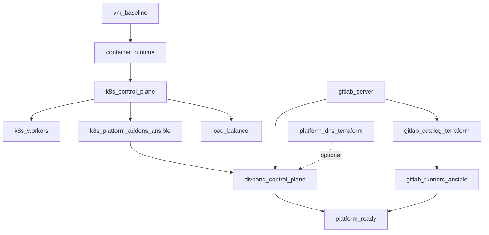

# Infrastructure orchestration

This document defines **who owns what** (Ansible, Terraform, backend API), **in what order** platform bootstrap runs, and **how automation decides the next step** when some layers are already provisioned.

Related docs:

- [VM reference architecture](./vm-reference-architecture.md) — host topology and inventory mapping
- [Operations — MVP provisioning runbook](./operations.md#mvp-provisioning-runbook-api-request-to-live-hostname) — per-project API flow after platform bootstrap
- [Architecture](./architecture.md) — control-plane overview
- Machine-readable plan: [`infra/orchestration/bootstrap-plan.json`](../infra/orchestration/bootstrap-plan.json)
- Planner CLI: [`infra/orchestration/plan-bootstrap.mjs`](../infra/orchestration/plan-bootstrap.mjs)

Related docs: [`README.md`](../README.md), [`docs/product.md`](../docs/product.md), [`docs/infrastructure-orchestration.md`](../docs/infrastructure-orchestration.md), [`docs/operations.md`](../docs/operations.md), [`infra/k8s/README.md`](../k8s/README.md).

## Core rule: one owner per resource

Never let Ansible and Terraform manage the same durable resource. Pick one controller and record it in code, state, and runbooks.

| Layer | Preferred owner | Examples |
| --- | --- | --- |
| VM OS bootstrap | **Ansible** | users, firewall, container runtime, k3s install, HAProxy, GitLab package install, runner agent install |
| Shared platform DNS (apex, wildcard, service hostnames) | **Terraform** (`infra/terraform/environments/production`) | `divband.ir`, `*.divband.ir`, `app.`, `grafana.` |
| Shared cluster add-ons | **Ansible *or* Terraform — pick one profile** | ingress-nginx, cert-manager, External Secrets, observability |
| GitLab platform catalog (seed tenants/projects/runners) | **Terraform** (`infra/gitlab/terraform`) | groups, branch protection, CI variables, project-scoped runners |
| GitLab server on a VM | **Ansible** (`roles/gitlab`) | Omnibus install or connect to existing endpoint |
| Per-project GitLab repo + CI setup | **Backend API** | triggered by `POST /projects/{id}/gitlab-repository` |
| Per-project Kubernetes namespace | **Backend API** (+ `kubectl`) | Auto welcome stack on `POST /projects`; renders [`infra/k8s/base`](../infra/k8s/base) |
| Per-customer domain TXT verification | **Backend API** (+ DNS provider adapter) | event-driven, not Terraform |

Terraform always runs on the **operator machine** (laptop, bastion, or protected CI job) — the Ansible controller — not on k3s control-plane nodes. Ansible playbooks that invoke Terraform use `delegate_to: localhost`.

## Bootstrap profiles

Two supported platform bootstrap profiles are encoded in `infra/orchestration/bootstrap-plan.json`.

### `vm_ansible` (default VM path)

Matches `infra/ansible/playbooks/site.yml` today:

1. Ansible prepares VMs and installs **k3s**.
2. Ansible installs **shared K8s add-ons** with `kubectl apply` (ingress, cert-manager, External Secrets, observability).
3. Ansible installs or connects **GitLab** on the `gitlab` inventory group.
4. **Terraform** (`infra/gitlab/terraform`) provisions the GitLab **platform catalog** (optional via `gitlab_run_terraform: true`, or run manually before runners).
5. Ansible registers **GitLab runners** (reads Terraform outputs or Vault tokens).
6. Ansible deploys the **Divband control plane** into the cluster.
7. **Terraform** platform DNS (`infra/terraform/environments/production`) is optional and manual unless you automate it separately.

Set `k8s_addons_owner: ansible` in orchestration state. Do **not** run production Terraform with `apply_kubernetes_resources = true` on the same cluster.

### `managed_terraform_k8s`

For managed Kubernetes or when you want Helm-based add-ons from Terraform:

1. Skip Ansible K8s add-on roles (or skip k3s entirely if the cluster already exists).
2. Run **`infra/terraform/environments/production`** with `apply_kubernetes_resources = true`.
3. Continue with GitLab catalog Terraform and runner Ansible registration as above.

Set `k8s_addons_owner: terraform` in orchestration state.

## Phase diagram (VM profile)



Solid arrows are hard dependencies. Dotted lines are optional parallel work (platform DNS can be applied once ingress target is known).

## Runtime flow (after platform bootstrap)

Once `platform_ready` is reached, **per-project** work is backend-driven:

```text
POST /projects
  → (automatic when KUBERNETES_APPLY=true)
     kubectl apply welcome stack in project-{slug}
     welcome nginx + platform ingress + deployment record + hostname attached
  → POST /projects/{id}/gitlab-repository or …/github-repository   (optional; user or agent)
  → GitLab CI deploys customer app into project-{slug} (replaces welcome page)
  → POST /projects/{id}/domains / …/verify for custom hostnames
```

Manual retry: `POST /projects/{id}/kubernetes-namespace` re-applies the welcome stack if automatic provisioning failed.

Further reading: [`README.md`](../README.md#project-auto-provision-on-k3s), [`operations.md`](./operations.md#mvp-provisioning-runbook-api-request-to-live-hostname), [`infra/k8s/README.md`](../infra/k8s/README.md), [`deployments.md`](./deployments.md).

Do not route these steps through Ansible or Terraform unless you are doing a one-time seed outside the product API.

## When to run which tool

Use this decision table during bootstrap automation:

| Question | If false / missing | Run next |
| --- | --- | --- |
| Can SSH reach all inventory hosts? | No | Fix networking; then `ansible-playbook` common play |
| Is k3s API up and kubeconfig artifact present? | No | Ansible `kubernetes` role (`site.yml`) |
| Are ingress, cert-manager, ESO, observability installed? | No | Ansible add-on plays **or** production Terraform (per profile, not both) |
| Is GitLab HTTP endpoint reachable? | No | Ansible `gitlab` role (`install` or `connect`) |
| Do GitLab groups/projects/runners exist in Terraform state? | No | `terraform apply` in `infra/gitlab/terraform` |
| Are runner tokens available (Terraform output or Vault)? | No | Apply GitLab Terraform first, or load Vault secrets |
| Are runners registered on runner VMs? | No | Ansible `gitlab_runner` role |
| Is Divband backend/frontend deployed? | No | Ansible `divband_app` role |
| Are platform DNS records published? | No | `terraform apply` in `infra/terraform/environments/production` (if using managed platform DNS) |
| Is platform bootstrap complete? | Yes | Hand off to backend API for project lifecycle |

## Orchestration state and automation

Automation should not guess from git files alone. Track bootstrap progress in a small state file and let the planner compute the next actions.

### Files

| File | Purpose |
| --- | --- |
| `infra/orchestration/bootstrap-plan.json` | Phase definitions, dependencies, owners, commands, probes |
| `infra/orchestration/state.example.json` | Example tracked state |
| `infra/orchestration/plan-bootstrap.mjs` | Reads plan + state (+ optional live probes) and prints the next steps |

### State file

Copy the example and update it as phases complete:

```sh
cp infra/orchestration/state.example.json infra/orchestration/state.json
```

Keep `state.json` out of git if it contains environment-specific timestamps or secrets. The example uses `"profile": "vm_ansible"` and `"k8s_addons_owner": "ansible"`.

Each phase status is one of:

- `pending` — not started
- `complete` — finished successfully
- `skipped` — intentionally not used in this environment (e.g. no `load_balancers` group)
- `failed` — last attempt failed; planner still suggests retry after dependencies are met

### Planner usage

Print the next bootstrap actions:

```sh
node infra/orchestration/plan-bootstrap.mjs \
  --state infra/orchestration/state.json
```

Include live readiness probes (kubeconfig file, GitLab URL, Terraform outputs):

```sh
node infra/orchestration/plan-bootstrap.mjs \
  --state infra/orchestration/state.json \
  --probe
```

Machine-readable JSON for a controller service:

```sh
node infra/orchestration/plan-bootstrap.mjs \
  --state infra/orchestration/state.json \
  --probe \
  --json
```

Example output fields:

- `complete` — phases already done (from state or successful probes)
- `ready` — phases whose dependencies are satisfied and should run next
- `blocked` — phases waiting on incomplete dependencies
- `actions` — concrete shell commands with `owner`, `phase`, and `reason`

### Integrating with backend or CI

A bootstrap controller (script, CI job, or future admin API) should:

1. Load `bootstrap-plan.json` and environment `state.json`.
2. Run `plan-bootstrap.mjs --probe --json` (or import the same logic in TypeScript later).
3. Execute **only** actions where `owner` matches the runner (`ansible` job on controller with inventory, `terraform` job with cloud/API tokens).
4. Mark phases `complete` or `failed` in `state.json` after each action.
5. Stop when `platform_ready` is `complete`; then enable backend project provisioning.

Suggested CI split:

| Job | Runs when planner returns | Needs |
| --- | --- | --- |
| `bootstrap-ansible` | actions with `owner: ansible` | SSH, inventory, vault |
| `bootstrap-terraform-gitlab` | `gitlab_catalog_terraform` | `GITLAB_TOKEN`, tfvars |
| `bootstrap-terraform-platform` | `platform_dns_terraform` | Cloudflare token, tfvars |
| `platform-verify` | all phases complete | HTTP checks, kubeconfig, backend `/health` |

### Probe auto-completion

When `--probe` is set, the planner can mark phases complete without manual state edits if evidence exists:

| Phase | Probe |
| --- | --- |
| `k8s_control_plane` | `infra/ansible/artifacts/kubeconfig` exists |
| `k8s_platform_addons_ansible` | `kubectl get ingressclass nginx` succeeds (using artifact kubeconfig) |
| `gitlab_server` | `GET $GITLAB_URL/users/sign_in` returns 200/302 |
| `gitlab_catalog_terraform` | `terraform output -json projects` succeeds in `infra/gitlab/terraform` |
| `gitlab_runners_ansible` | phase marked complete only via state (no safe global probe) |
| `platform_dns_terraform` | `terraform output platform_dns` succeeds in production stack |

Probes reduce drift between “we ran the playbook yesterday” and “state.json still says pending”. Prefer updating `state.json` after controlled runs in production.

## Ansible variables that affect Terraform handoff

| Variable | Default | Effect |
| --- | --- | --- |
| `gitlab_run_terraform` | `false` | When `true`, `roles/gitlab` runs `terraform plan/apply` on localhost after GitLab install/connect |
| `gitlab_runner_allow_terraform_token_lookup` | `true` | Runner role reads `terraform output` on localhost when Vault token is absent |
| `gitlab_runner_project_key` | empty | Required for Terraform output lookup, e.g. `acme/marketing` |

Recommended fresh-environment sequence:

```sh
# 1. Bootstrap cluster and GitLab server
ansible-playbook -i infra/ansible/inventory.yml infra/ansible/playbooks/site.yml \
  --tags never  # or run full site without runner play first

# 2. GitLab catalog (if not using gitlab_run_terraform: true)
terraform -chdir=infra/gitlab/terraform init
terraform -chdir=infra/gitlab/terraform apply

# 3. Runners + remaining plays
ansible-playbook -i infra/ansible/inventory.yml infra/ansible/playbooks/runners.yml

# 4. Optional platform DNS
terraform -chdir=infra/terraform/environments/production init
terraform -chdir=infra/terraform/environments/production apply

# 5. Verify plan is empty
node infra/orchestration/plan-bootstrap.mjs --state infra/orchestration/state.json --probe
```

Or enable `gitlab_run_terraform: true` in inventory to fold step 2 into the GitLab Ansible role.

## Ownership quick reference

```text
Operator controller (localhost / CI)
├── Ansible
│   ├── VM + k3s + load balancer
│   ├── K8s add-ons (vm_ansible profile)
│   ├── GitLab Omnibus install / connect
│   ├── GitLab Runner agent install + register
│   └── Divband control plane Deployment
├── Terraform
│   ├── infra/gitlab/terraform → GitLab catalog + runner tokens
│   └── infra/terraform/environments/production → platform DNS (+ optional K8s add-ons)
└── Backend API (after platform_ready)
    ├── Per-project GitLab repository
    ├── Per-project K8s namespace (infra/k8s/base)
    └── Per-project / custom domain DNS verification
```

## Anti-patterns

- Installing Terraform on k3s nodes — run it on the controller only.
- Running production Terraform K8s add-ons **and** Ansible ingress/cert-manager on the same cluster.
- Using Ansible `uri` modules to manage GitLab projects that Terraform or the backend already own.
- Using Terraform to create a namespace for every API `POST /projects` request — use the backend lifecycle instead.
- Committing `state.json`, `terraform.tfvars`, or runner tokens to git.
