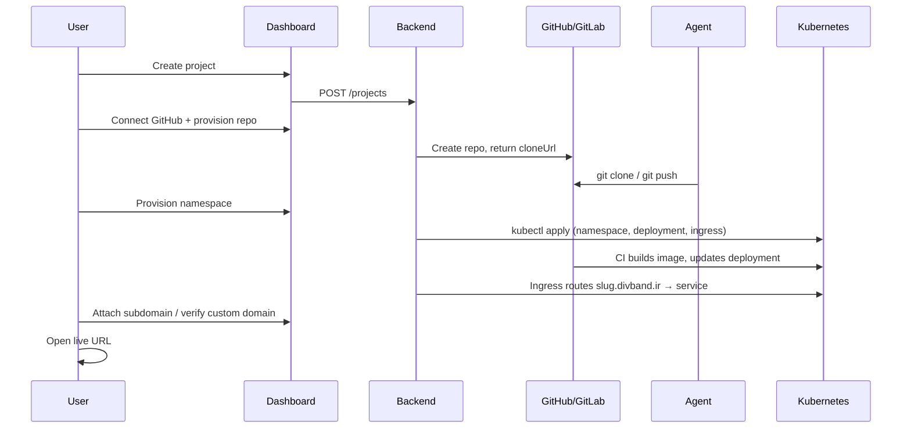
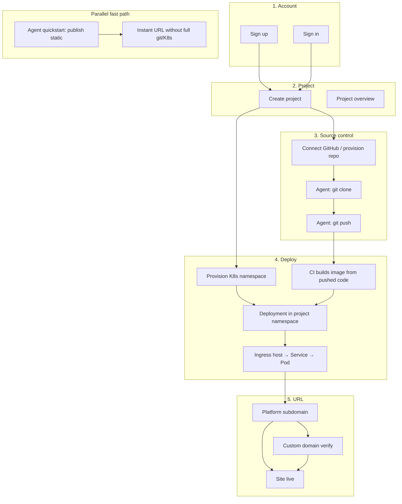
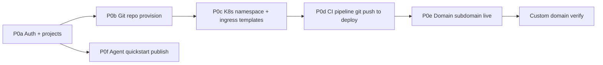

# divband MVP scope

This document defines the **minimal workable MVP** for divband: what must work end-to-end, what is explicitly out of scope, and how the pieces connect. It complements `docs/product.md` (full product vision and backlog) and `docs/local-mvp.md` (how to run the stack locally).

For architecture and monorepo layout, see `docs/architecture.md`.

## MVP in one sentence

A signed-in user creates a project, connects a **real git repository**, an **agent can push and pull code there**, the platform **deploys that code into a dedicated Kubernetes namespace**, **ingress routes traffic** to the running workload, and **domain management** exposes the live URL — with **agent instant publish** as a fast alternative path.

## Priority tags

| Tag | Meaning |
| --- | --- |
| **P0 — Core** | Without this, the app is not a usable MVP. Build first. |
| **P1 — Core+** | Makes the MVP feel complete after P0 works. Build right after P0. |
| **P2 — Later** | Real product value, but not blocking a demo. Defer. |
| **CUT** | Skip for MVP. Do not build yet. |

## Auth model (simplified for MVP)

Treat every account as either **`user`** or **`platform admin`**. Do not implement the full owner / admin / developer / viewer matrix, project API tokens, member invites, or abuse/suspension tooling until P0 flows work.

| Role | Who | Can do |
| --- | --- | --- |
| `user` | Normal signed-in user | Own and manage their projects |
| `admin` | Operator | See all projects and basic platform ops |

## MVP feature list

| # | Feature | Tag | MVP meaning |
| --- | --- | --- | --- |
| 1 | Sign up | **P0** | Email + password, get a session |
| 2 | Sign in | **P0** | Resume session |
| 3 | Project list | **P0** | See all your projects |
| 4 | Create project | **P0** | Name + slug → namespace name, hostname, runner tag planned |
| 5 | Project overview | **P0** | Status, repo URL, namespace, hostname, latest deploy |
| 6 | Agent quickstart | **P0** | Docs + API for instant static publish |
| 7 | Domain management | **P0** | Platform subdomain + custom domain verify |
| 8 | Git repo provision | **P0** | Code lives in GitHub/GitLab; clone URL returned |
| 9 | Agent git push/pull | **P0** | Agent uses normal git against that repo (SSH/HTTPS token) |
| 10 | K8s namespace provision | **P0** | Per-project namespace + quota/RBAC |
| 11 | Deploy to K8s | **P0** | Build from git ref → workload in namespace |
| 12 | Ingress → deployment | **P0** | `{slug}.divband.ir` (and custom domain) hits the running app |
| 13 | Build logs | **P1** | See CI/build output in dashboard |
| 14 | Custom domain TLS | **P2** | Real cert-manager issuance after DNS verify works |
| 15 | Claim anonymous publish | **P2** | Attach instant publish to signed-in account |

## Explicitly out of MVP (CUT)

| Area | Defer |
| --- | --- |
| Multi-role RBAC | owner / admin / developer / viewer, per-permission checks |
| Team | Member invites, org switching UI |
| Security polish | Rate limits, audit viewer, abuse actions, session revoke UI |
| Auth extras | Password reset, email verification gate, generic OAuth/OIDC |
| Admin | All `#admin-*` dashboard pages (7 operator views) |
| AI | AI assistant, change requests, patch/MR/CI mock flow |
| Deploy extras | Rollback, staging/preview environments |
| DNS extras | Delegated nameserver zones, apex ALIAS handling |
| Business | Billing tiers, quotas, API tokens |
| Infra-only | Terraform/Ansible production bootstrap (needed for prod, not app MVP acceptance) |

## Dashboard pages in MVP

| Page | Hash / route | Role |
| --- | --- | --- |
| Sign up | `#sign-up` | Create account |
| Sign in | `#sign-in` | Authenticate |
| Project list | `#project-list` | Pick a project |
| Create project | `#create-project` | Start lifecycle |
| Project overview | `#project-overview` | Repo, namespace, deploy state, URLs |
| GitLab repository status | `#gitlab-repository-status` | Connect GitHub, provision repo, show clone URL |
| Deployment status | `#deployment-status` | Trigger deploy, see state |
| Domain management | `#domain-management` | Platform hostname + custom domain verify |
| Agent quickstart | `#agent-quickstart` | curl/MCP examples for instant publish |
| Logs and build history | `#logs-build-history` | **P1** — helpful once deploy loop works |

**Hide for MVP:** all `#admin-*` pages, `#ai-assistant`, member management UI, API token UI.

## Two hosting paths

Both belong in MVP. They serve different speeds.

### Path A — Full project (git + Kubernetes) — core MVP

This is the main product loop: code in git, CI builds and deploys, ingress serves traffic.



### Path B — Agent instant publish (fast wedge)

For static output without waiting for CI/Kubernetes:

1. `POST /api/v1/publish`
2. Upload files to presigned URLs
3. `POST /api/v1/publish/{slug}/finalize`
4. Live at `{slug}.divband.site` (or local equivalent)

See `docs/agent-instant-hosting.md` and the `#agent-quickstart` dashboard page.

## End-to-end MVP flow



## Git: agent push and pull

The MVP does **not** need a special divband push API. It needs:

| Requirement | How |
| --- | --- |
| Code has a home | Backend provisions GitHub/GitLab repo → returns `cloneUrl` |
| Agent can pull | `git clone` with deploy key or OAuth token |
| Agent can push | `git push origin main` (or branch) with same credentials |
| Deploy reacts to push | GitLab CI (`.gitlab-ci.yml` in repo) builds + deploys to namespace |

**API surface:**

| Action | Endpoint |
| --- | --- |
| Start GitHub OAuth | `POST /auth/github/oauth/start` |
| OAuth callback | `GET /auth/github/callback` |
| Provision project repo | `POST /projects/{id}/gitlab-repository` or `…/github-repository` |
| Browse repo files (optional) | `GET /projects/{id}/repository/contents?path=…` |

Agents use git like any developer. The platform owns repo creation and CI wiring.

## Kubernetes and ingress

When namespace is provisioned (`POST /projects/{id}/kubernetes-namespace`), the backend renders and applies templates from `infra/k8s/base/`, including:

| Template | Purpose |
| --- | --- |
| `tenant-namespace.yaml` | Isolated namespace `project-{slug}` |
| `network-policy.yaml`, `rbac.yaml` | Tenant isolation |
| `*-deployment.yaml` | Workload (frontend/backend/static) |
| `ingress.yaml` | Host `{slug}.divband.ir` → service → pods |
| `Certificate` | TLS (can be pending in local MVP) |

Traffic path:

```text
Internet → Ingress (Host: my-site.divband.ir)
         → Service (public-web)
         → Deployment (app container)
         in namespace: project-my-site
```

Enable real apply with `KUBERNETES_APPLY=true` and a reachable cluster (`kubectl` on PATH). See `apps/backend/src/services/kubernetes.ts`.

**Deploy loop gap to close:** provisioned repos need a **CI template** that builds on push, updates the K8s deployment in `project-{slug}`, and reports status to `POST /projects/{id}/deployments/report`.

## Domain management

| Action | Endpoint |
| --- | --- |
| Attach platform subdomain | `POST /projects/{id}/platform-subdomain` |
| Add custom domain | `POST /projects/{id}/domains` |
| Get DNS setup | `GET /projects/{id}/domains/{id}/dns-setup` |
| Verify ownership | `POST /projects/{id}/domains/{id}/verify` |

**P0:** platform subdomain works and ingress hostname resolves.

**P1:** custom domain add + manual token verify (local MVP can paste token).

**P2:** real DNS provider checks and TLS automation.

## MVP success criteria

MVP is done when someone can run this script:

1. Sign up → create project `demo-site`
2. Connect GitHub → repo exists with clone URL
3. Agent runs: `git clone … && echo hello > index.html && git push`
4. CI runs → pod running in `project-demo-site`
5. Open `https://demo-site.divband.ir` → sees the pushed content
6. **(P1)** Add custom domain → verify DNS → same app on custom host
7. **(Parallel)** Agent quickstart publishes a static folder to a live URL without steps 3–5

## Recommended build order



| Step | Build |
| --- | --- |
| **P0a** | Sign up, sign in, project CRUD, overview |
| **P0b** | GitHub connect + repo provision + show clone URL |
| **P0c** | Real `kubectl apply` for namespace + deployment + ingress |
| **P0d** | CI template: build on push → deploy to namespace → report status to API |
| **P0e** | Platform subdomain attached and ingress hostname works |
| **P0f** | Agent quickstart publish path (parallel wedge) |
| **P1** | Custom domain verify, build logs in dashboard |
| **P2** | TLS, claim anonymous publish, production hardening |

## Implementation status (vs this MVP)

| MVP piece | In repo today | Still needed |
| --- | --- | --- |
| Sign up / sign in | Yes | — |
| Project list / create / overview | Yes | Simpler lifecycle UI |
| Agent quickstart | Yes (API + page) | Harden serving locally |
| Domain management | Yes (API + page) | Real DNS/TLS optional for local |
| Git repo provision | Partial (GitHub OAuth, provision endpoint) | CI template wired into new repos |
| Agent git push/pull | Indirect (clone URL + token) | Deploy keys / token docs for agents |
| K8s namespace | Yes (templates + optional apply) | Turn on `KUBERNETES_APPLY`, real cluster |
| Deploy to K8s | Partial (deployment records) | CI actually updates workloads |
| Ingress mapping | Yes (in `infra/k8s/base/ingress.yaml`) | End-to-end test with live cluster |

## Related documents

| Document | Purpose |
| --- | --- |
| `docs/product.md` | Full product vision, backlog, and release readiness |
| `docs/architecture.md` | Monorepo layout, services, and request flows |
| `docs/local-mvp.md` | Run backend/frontend locally with mocked deps |
| `docs/agent-instant-hosting.md` | Publish API contract for agents |
| `docs/gitlab.md` | GitLab integration notes |
| `infra/k8s/base/` | Tenant namespace, deployment, and ingress templates |
| `infra/gitlab/ci-templates/` | CI templates to embed in provisioned repos |
