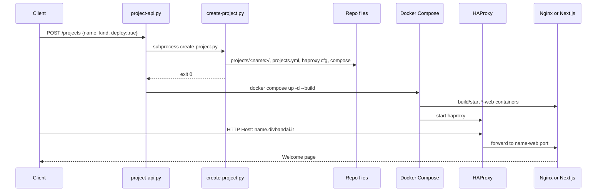

# Divband Platform Guide

This document describes **divband** (repository: `divbandai`): a small infrastructure stack and **project provisioning API** that lets a caller create Docker-backed web services, wire them into **HAProxy** by hostname, and populate each service with a chosen runtime (**Nginx static site** or **Next.js**).

The design goal is repeatable, single-VM hosting: one public HTTP entrypoint, many projects behind host-based routing, with generated configs kept in git and deployable by hand, Make, HTTP API, or Ansible.

---

## What the system does

| Capability | How it works |
| --- | --- |
| **Create a project** | CLI (`make project`) or HTTP API (`POST /projects`) runs `scripts/create-project.py`. |
| **Scaffold app content** | `static` → Nginx + HTML; `nextjs` → Next.js app + Dockerfile. |
| **Register domains** | Each project gets `{name}.divbandai.ir` (and special apex domains for `test`). |
| **Route traffic** | `config/haproxy/haproxy.cfg` is regenerated with ACLs and backends per project. |
| **Run containers** | `docker-compose.yml` is regenerated: HAProxy + one `{name}-web` service per project. |
| **Deploy** | `docker compose up -d` locally, via API (`POST /deploy` or `deploy: true`), or Ansible on a VPS. |

There is **no Kubernetes**, **no multi-tenant auth inside apps**, and **no TLS** in this branch. The “control plane” is the project generator plus an optional local HTTP API—not a separate orchestrator service.

---

## High-level architecture

```text
                    ┌─────────────────────────────────────────┐
                    │  Caller (human, curl, automation)       │
                    └───────────────┬─────────────────────────┘
                                    │
          ┌─────────────────────────┼─────────────────────────┐
          │                         │                         │
          v                         v                         v
   make project              POST /projects            Ansible playbooks
   create-project.py         project-api.py            (local / remote)
          │                         │                         │
          └─────────────────────────┼─────────────────────────┘
                                    v
              ┌─────────────────────────────────────────────┐
              │  Source of truth: infra/ansible/vars/       │
              │  projects.yml  +  projects/<name>/ files      │
              └─────────────────────┬───────────────────────┘
                                    v
              ┌─────────────────────────────────────────────┐
              │  Generated (checked in):                    │
              │  • config/haproxy/haproxy.cfg               │
              │  • docker-compose.yml                       │
              └─────────────────────┬───────────────────────┘
                                    v
              ┌─────────────────────────────────────────────┐
              │  Docker Compose on one host (VM or laptop)    │
              │                                               │
              │  ┌──────────────┐      ┌─────────────────┐  │
              │  │  haproxy:80  │─────►│  test-web       │  │
              │  │  (router)    │      │  nginx:static   │  │
              │  └──────┬───────┘      └─────────────────┘  │
              │         │              ┌─────────────────┐  │
              │         └─────────────►│  test2-web      │  │
              │                        │  nextjs:3000    │  │
              │                        └─────────────────┘  │
              │         network: divband                      │
              └─────────────────────────────────────────────┘
                                    ^
                                    │ DNS A → host:80
                              Internet clients
```

### Request path (example: `test2.divbandai.ir`)

1. Client resolves DNS to the VM (or uses `/etc/hosts` locally).
2. TCP connects to port **80** on the host.
3. **HAProxy** `frontend public_http` matches `Host: test2.divbandai.ir`.
4. Traffic goes to `backend test2_project` → container `test2-web:3000`.
5. Next.js serves `/` and `/healthz` (used by HAProxy health checks).

Unknown hosts hit `backend unknown_host` → **HTTP 404** with body `Unknown divband host`.

---

## Core components

| Component | Location | Role |
| --- | --- | --- |
| **Project generator** | `scripts/create-project.py` | Validates name, writes project files, updates `projects.yml`, regenerates HAProxy and Compose. |
| **Project API** | `scripts/project-api.py` | Threaded HTTP server wrapping the generator and optional `docker compose` deploy. |
| **Project registry** | `infra/ansible/vars/projects.yml` | List of projects: `name`, `kind`, `port`, `domains`. Shared by generator and Ansible templates. |
| **HAProxy config** | `config/haproxy/haproxy.cfg` | Host-header routing, health checks, backends. |
| **Compose stack** | `docker-compose.yml` | `haproxy` + `{name}-web` services on network `divband`. |
| **Project trees** | `projects/<name>/` | Static HTML/nginx or Next.js source built into images. |
| **Ansible** | `infra/ansible/` | Local/remote Docker install, template deploy to `/opt/divband`, smoke tests, optional Arvan mirror/registry. |

Deeper request-flow notes: [architecture.md](architecture.md).  
Manual VPS steps: [manual-ssh-deployment.md](manual-ssh-deployment.md).  
Ansible operations: [../infra/ansible/README.md](../infra/ansible/README.md).

---

## Project types (`kind`)

### `static` (default)

- **Container**: official **Nginx** image (`nginx:1.27-alpine`, or `docker.arvancloud.ir/nginx:...` when Arvan mode is on).
- **Files created** under `projects/<name>/`:
  - `html/index.html` — welcome page (`Welcome to <name>`).
  - `nginx.conf` — `server_name` for all project domains; `/healthz` returns `ok`; SPA-style `try_files`.
- **Backend port**: **80** (Nginx inside the container).
- **Use when**: marketing pages, simple static sites, placeholders.

### `nextjs`

- **Container**: image `divband-<name>:local` built from `projects/<name>/Dockerfile` (Node 20 Alpine, `npm run build`, production `npm start` on `0.0.0.0:3000`).
- **Files created**:
  - `package.json`, `Dockerfile`, `app/page.jsx`, `app/layout.jsx`, `app/globals.css`, `app/healthz/route.js`.
- **Backend port**: **3000**.
- **Use when**: React/Next apps that need server-side rendering or a Node runtime.

### `node`

- **Container**: Express app on port **3000**, built from `projects/<name>/Dockerfile`.
- **Use when**: lightweight Node HTTP services.

### `python`

- **Container**: Flask + Gunicorn on port **8000**.
- **Use when**: Python APIs or small WSGI apps.

### `docker`

- **Container**: built from a caller-provided `Dockerfile` under `projects/<name>/`.
- **Use when**: custom runtimes; set `"port"` and optional `"dockerfile"` in the API body.

### Shared project options (API)

| Field | Meaning |
| --- | --- |
| `env` | Inline environment variables in Compose |
| `env_file` | Path to a gitignored env file |
| `secrets` | List of env file paths (not stored in git) |
| `health_check` | HAProxy health path (default `/healthz`) |
| `tls` | Enable HAProxy `:443` for project domains |
| `dns` | When `true`, call optional DNS provider on create/delete |
| `async` | Return `202` + job id for long builds |
| `callback_url` | Webhook when async job completes |

Pinned dependency versions in the generator: Next `16.2.7`, React `19.2.7` (see `create-project.py` constants).

---

## Naming, domains, and routing rules

### Project name

Must match DNS label rules (enforced in `create-project.py`):

```text
[a-z0-9](?:[a-z0-9-]{0,61}[a-z0-9])?
```

Lowercase letters, numbers, hyphens; no leading/trailing hyphen; max 63 characters.

### Default domains

| Project name | Domains assigned |
| --- | --- |
| `test` | `divbandai.ir`, `www.divbandai.ir`, `test.divbandai.ir` |
| Any other `name` | `name.divbandai.ir` only |

Extra domains: CLI `--domain example.com` or API `"domains": ["example.com"]`.

### HAProxy behavior (per project)

For each entry in `divband_projects`, the generator adds:

1. **ACLs** on `Host` (with and without `:80` suffix).
2. **`use_backend {name}_project`** when ACL matches.
3. **`backend {name}_project`** with:
   - `option httpchk GET /healthz`
   - `server {name}_web {name}-web:{port} check`

Compose service names must stay aligned: service `{name}-web`, container `divband-{name}-web`, DNS name on Docker network `divband` is `{name}-web`.

---

## Provisioning workflows

### 1. Makefile / CLI (developer machine)

```bash
# Static site at test.divbandai.ir (and apex if NAME=test)
make project NAME=myapp

# Next.js at myapp2.divbandai.ir
make project NAME=myapp2 KIND=nextjs

# Start or refresh stack
make up
make smoke
```

`KIND` defaults to `static`. The generator prints domains and reminds you to run `docker compose up -d`.

### 2. HTTP Project API (local control plane)

Start the API:

```bash
make api
# or: DIVBAND_API_HOST=0.0.0.0 DIVBAND_API_PORT=8080 make api
```

Optional auth for mutating/list routes:

```bash
export DIVBAND_API_TOKEN=your-secret
make api
```

| Method | Path | Auth | Description |
| --- | --- | --- | --- |
| `GET` | `/` | No | Service metadata and route list. |
| `GET` | `/healthz` | No | `{"status":"ok"}`. |
| `GET` | `/v1/metrics` | No | Prometheus metrics. |
| `GET` | `/v1/projects` | Bearer if token set | List projects from `projects.yml`. |
| `GET` | `/v1/projects/{name}` | Bearer if token set | One project plus runtime hints. |
| `GET` | `/v1/projects/{name}/status` | Bearer if token set | Container state for a project. |
| `GET` | `/v1/projects/{name}/backups` | Bearer if token set | List backups for a project. |
| `GET` | `/v1/status` | Bearer if token set | Docker Compose service list + last deploy. |
| `GET` | `/v1/drift` | Bearer if token set | Registry vs Docker vs config drift. |
| `GET` | `/v1/system/docker` | Bearer if token set | Images and disk usage. |
| `GET` | `/v1/system/git` | Bearer if token set | Git dirty paths (repo mutation hint). |
| `GET` | `/v1/environments` | Bearer if token set | Ansible environment map. |
| `GET` | `/v1/jobs/{id}` | Bearer if token set | Async job status. |
| `POST` | `/v1/projects` | Bearer if token set | Create/refresh project; optional deploy/DNS/async. |
| `POST` | `/v1/projects/{name}/backup` | Bearer if token set | Tarball backup of project tree. |
| `POST` | `/v1/projects/{name}/restore` | Bearer if token set | Restore from backup. |
| `PUT` | `/v1/projects/{name}` | Bearer if token set | Replace project definition. |
| `PUT` | `/v1/projects/{name}/files` | Bearer if token set | Upload static assets. |
| `PATCH` | `/v1/projects/{name}` | Bearer if token set | Update kind, domains, env, TLS, etc. |
| `DELETE` | `/v1/projects/{name}` | Bearer if token set | Delete project; optional backup/DNS/prune. |
| `POST` | `/v1/deploy` | Bearer if token set | Deploy actions (supports `async`). |
| `POST` | `/v1/remote/deploy` | Bearer if token set | Trigger Ansible for an environment. |

Legacy unprefixed paths (`/projects`, `/deploy`, `/status`) still work. OpenAPI: [openapi.yaml](openapi.yaml). API TLS: [api-tls.md](api-tls.md).

**Create project (static, no deploy):**

```bash
curl -s -X POST http://127.0.0.1:8080/v1/projects \
  -H 'Content-Type: application/json' \
  -d '{"name":"demo","kind":"static"}'
```

**Create and deploy in one call:**

```bash
curl -s -X POST http://127.0.0.1:8080/v1/projects \
  -H 'Content-Type: application/json' \
  -H "Authorization: Bearer ${DIVBAND_API_TOKEN}" \
  -d '{"name":"demo2","kind":"nextjs","deploy":true}'
```

**Add a domain without rescaffolding app content:**

```bash
curl -s -X PATCH http://127.0.0.1:8080/v1/projects/demo \
  -H 'Content-Type: application/json' \
  -d '{"domains":["extra.example.com"],"deploy":true,"deploy_action":"reload-haproxy"}'
```

**Delete a project:**

```bash
curl -s -X DELETE http://127.0.0.1:8080/v1/projects/demo \
  -H "Authorization: Bearer ${DIVBAND_API_TOKEN}"
```

**Deploy only:**

```bash
curl -s -X POST http://127.0.0.1:8080/v1/deploy \
  -H 'Content-Type: application/json' \
  -H "Authorization: Bearer ${DIVBAND_API_TOKEN}" \
  -d '{"action":"up","build":true}'

# Rebuild/deploy one service
curl -s -X POST http://127.0.0.1:8080/v1/deploy \
  -H 'Content-Type: application/json' \
  -d '{"action":"restart","project":"demo2","build":true}'

# Reload HAProxy after routing-only config change
curl -s -X POST http://127.0.0.1:8080/v1/deploy \
  -H 'Content-Type: application/json' \
  -d '{"action":"reload-haproxy"}'
```

**POST /projects body fields:**

| Field | Type | Default | Meaning |
| --- | --- | --- | --- |
| `name` | string | required | Project name (DNS-safe). |
| `kind` | `static` \| `nextjs` | `static` | Container/scaffold type. |
| `domains` | string[] | `[]` | Extra hostnames (appended to defaults). |
| `deploy` | bool | `false` | Run `docker compose up -d --build` after generate. |
| `non_arvan_images` | bool | `false` | Write Compose without `docker.arvancloud.ir/` prefix. |

The API uses a **process-wide write lock** so concurrent mutating requests do not corrupt generated files. It imports `scripts/divband_projects.py` directly (no subprocess). Errors use `{"error","code","details","request_id"}`.

**Security note:** The API is intended for **localhost or trusted networks**. It can execute Docker and rewrite repository files. Always set `DIVBAND_API_TOKEN` if the listener is not bound to loopback.

### 3. Ansible (local or VPS)

Both paths read `vars/projects.yml` and render Jinja templates equivalent to the Python generator output.

| Target | Playbook | App directory | Arvan |
| --- | --- | --- | --- |
| Local | `playbooks/local-docker.yml` | Repo root | Off (`divband_arvan_enabled: false`) |
| Remote | `playbooks/remote-docker.yml` | `/opt/divband` | **Required** `-e divband_arvan_enabled=true\|false` |

```bash
make ansible-local
make ansible-remote INVENTORY=infra/ansible/inventory.yml
```

Remote playbooks can pin Arvan mirror/registry when the VPS cannot reach global Ubuntu/Docker endpoints (see [infra/ansible/README.md](../infra/ansible/README.md)).

---

## What gets generated (file-level)

When you create project `foo` with `kind: static`:

```text
projects/foo/html/index.html
projects/foo/nginx.conf
infra/ansible/vars/projects.yml     # updated list
config/haproxy/haproxy.cfg        # full regen from all projects
docker-compose.yml                # haproxy + all *-web services
```

For `kind: nextjs`, the `html/` and `nginx.conf` paths are replaced by the Next.js tree and Dockerfile; Compose adds a `build:` section for `foo-web`.

Refreshing an existing name **updates** domains/kind/port in `projects.yml` and overwrites scaffold files; it does not delete unrelated projects.

---

## Docker Compose layout

Always present:

- **`haproxy`**: binds host `80:80`, mounts `./config/haproxy/haproxy.cfg`, depends on every `{name}-web`.
- **`{name}-web`**: one per project in `projects.yml`.
- **`networks.divband`**: named bridge `divband` so HAProxy resolves `test-web`, `test2-web`, etc.

Image sources:

- **Local / non-Arvan**: `haproxy:2.9-alpine`, `nginx:1.27-alpine` from Docker Hub.
- **Arvan mode** (remote default): prefix `docker.arvancloud.ir/` on pull-only images; Next.js images are still built locally as `divband-{name}:local`.

Next.js services set `NODE_ENV=production` and require `docker compose build` (or `up --build`) before first run.

---

## DNS and local testing

Production expects **A records** for every hostname in `projects.yml` pointing at the VM public IP.

Local testing without DNS:

```text
127.0.0.1 divbandai.ir www.divbandai.ir test.divbandai.ir test2.divbandai.ir
```

Then:

```bash
curl -H "Host: test.divbandai.ir" http://127.0.0.1/
make smoke
```

`scripts/smoke-projects.sh` reads `projects.yml` and curls each domain with the expected `Welcome to {name}` substring.

---

## End-to-end sequence (API caller → live site)



---

## Configuration reference

### `infra/ansible/vars/projects.yml`

```yaml
divband_projects:
  - name: test
    kind: static
    port: 80
    domains:
      - divbandai.ir
      - www.divbandai.ir
      - test.divbandai.ir
  - name: test2
    kind: nextjs
    port: 3000
    domains:
      - test2.divbandai.ir
```

Ansible templates (`haproxy.cfg.j2`, `docker-compose.yml.j2`, `nginx.conf.j2`) iterate this list. The Python generator must stay consistent with those templates.

### Important Ansible variables (`vars/common.yml`)

| Variable | Purpose |
| --- | --- |
| `divband_unknown_domain` | Host used in smoke test for 404 (`unknown.divband.com`). |
| `divband_install_docker` | Install Docker via apt when true. |
| `divband_deploy_stack` | Render configs and `docker compose up -d`. |
| `divband_arvan_hosts` | IPs to pin `mirror.arvancloud.ir` / `docker.arvancloud.ir` on remote hosts. |

---

## Repository map (extended)

```text
.
├── docker-compose.yml              # Generated stack (HAProxy + projects)
├── Makefile                        # up/down/smoke/project/api/ansible targets
├── config/haproxy/haproxy.cfg      # Generated routing
├── projects/<name>/                # Per-tenant app + server config
├── scripts/
│   ├── create-project.py           # Generator (CLI + API backend)
│   ├── project-api.py              # HTTP control plane
│   └── smoke-projects.sh           # Host-header smoke tests
├── docs/
│   ├── platform-guide.md           # This document
│   ├── architecture.md
│   └── manual-ssh-deployment.md
└── infra/ansible/
    ├── vars/projects.yml           # Project registry
    ├── vars/common.yml
    ├── templates/                  # Jinja: haproxy, compose, nginx
    ├── tasks/                      # docker-debian, project-stack, smoke, arvan
    └── playbooks/                  # local-docker, remote-docker, validate-*
```

---

## Current limitations and intentional non-goals

This branch does **not** provide:

- HTTPS / automatic certificates
- Per-project databases, volumes, or secrets management
- Multi-VM or Kubernetes scheduling
- Git push-to-deploy or CI pipelines
- Rate limiting, WAF, or tenant isolation beyond Docker network + host routing
- Remote exposure of the Project API (only documented for local use)

The README and [architecture.md](architecture.md) list these as out of scope for the “small starting point” branch.

---

## Operational checklist

**Add a new public site**

1. `make project NAME=<label> KIND=static|nextjs` or `POST /projects`.
2. Commit generated files if you use git-as-source-of-truth.
3. Create DNS A record for `<label>.divbandai.ir` → VM IP.
4. `docker compose up -d --build` on the host (or `deploy: true` / Ansible).
5. `make smoke` or curl with `Host` header.
6. Verify from outside: `curl http://<label>.divbandai.ir/`.

**Remove a project**

1. `make project-delete NAME=<label>` or `DELETE /v1/projects/<label>`.
2. Commit generated file changes if you use git-as-source-of-truth.
3. Remove DNS records manually (or automate later).

See [api-todo.md](api-todo.md) for remaining backlog (async deploy, TLS, remote targets, etc.).

---

## Quick reference

| Goal | Command |
| --- | --- |
| Create static project | `make project NAME=app` |
| Delete project | `make project-delete NAME=app` |
| Run API tests | `make test-api` |
| Create Next.js project | `make project NAME=app KIND=nextjs` |
| Run API | `make api` |
| Start stack | `make up` |
| Test routing | `make smoke` |
| Local Ansible deploy | `make ansible-local` |
| VPS Ansible deploy | `make ansible-remote INVENTORY=infra/ansible/inventory.yml` |

For environment-specific Arvan toggle and validation playbooks, see the Makefile `ansible-*` targets and [infra/ansible/README.md](../infra/ansible/README.md).
